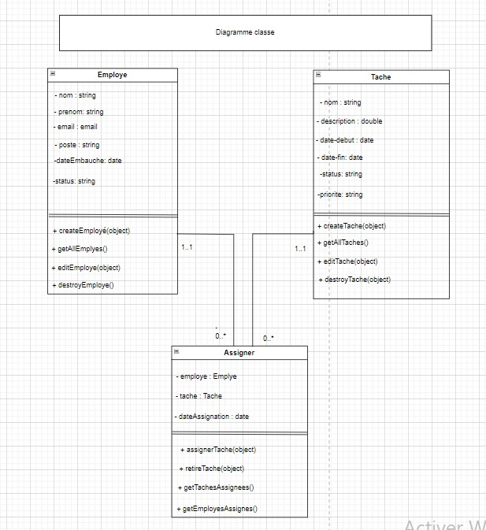

# Projet de Gestion des Employés et des Tâches

Ce projet est une application Node.js utilisant Express pour gérer les employés et les tâches dans une entreprise. Il permet de créer, modifier, et assigner des tâches à des employés.

## Table des matières

- [Prérequis](#prérequis)
- [Installation](#installation)
- [Utilisation](#utilisation)
- [Structure du Projet](#structure-du-projet)
- [Fonctionnalités](#fonctionnalités)
- [Diagramme de Classe](#diagramme-de-classe)
- [API Endpoints](#api-endpoints)
- [Contribution](#contribution)
- [Licence](#licence)
- [Contact](#contact)
-  [Auteur](#auteur)

## Prérequis

- Node.js (version recommandée : 14.x ou supérieure)
- npm (généralement installé avec Node.js)

## Installation

1. Clonez le dépôt :
```bash
   git clone https://github.com/MohamedSoumare/gestion-projets-tp-45-expressjs.git
```

2. **Naviguez dans le répertoire du projet :**

```bash
   cd  gestion-projets-tp-45-expressjs
```

3. Installez les dépendances :

```bash
   npm install
```

## Utilisation

Pour démarrer le serveur :

```bash
  npm start
```

Le serveur démarrera sur `http://localhost:3090`.

## Structure du Projet

Le projet est composé de plusieurs fichiers JavaScript :

- `index.js` : Point d'entrée de l'application, configuration du serveur Express
- `Employe.js` : Classe pour gérer les employés
- `Tache.js` : Classe pour gérer les tâches
- `Assigner.js` : Classe pour gérer l'assignation des tâches aux employés

## Fonctionnalités

1. Gestion des Employés :
   - Créer un nouvel employé
   - Modifier les informations d'un employé
   - Récupérer les informations d'un employé
   - Supprimer un employé

2. Gestion des Tâches :
   - Créer une nouvelle tâche
   - Modifier une tâche existante
   - Récupérer les informations d'une tâche
   - Supprimer une tâche

3. Assignation des Tâches :
   - Assigner une tâche à un employé
   - Retirer une tâche assignée
   - Obtenir la liste des tâches par employé
   - Obtenir la liste des employés par tâche

## Diagramme de Classe



Ce diagramme illustre la structure des classes `Employe`, `Tache`, et `Assigner`, ainsi que leurs relations.

## API Endpoints

- `GET /` : Message de bienvenue
- `POST /app` :  Crée des employés et des tâches, les assigne, et retourne les résultats

## Contribution

Les contributions à ce projet sont les bienvenues. Veuillez suivre ces étapes :

1. Forkez le projet
2. Créez votre branche de fonctionnalité (`git checkout -b nom_de_la_branche`)
3. Committez vos changements (`git commit -m ' Mettez votre commit'`)
4. Poussez vers la branche (`git push origin nom_de_la_branche`)
5. Ouvrez une Pull Request

## License

[MIT](https://choosealicense.com/licenses/mit/)

## Contact
Mohamed Bakary Soumaré - soumare17763@gmail.com

Lien du projet : [https://github.com/MohamedSoumare/gestion-projets-tp-45-expressjs.git](https://github.com/MohamedSoumare/gestion-projets-tp-45-expressjs.git)

## Author

Mohamed Bakary Soumaré